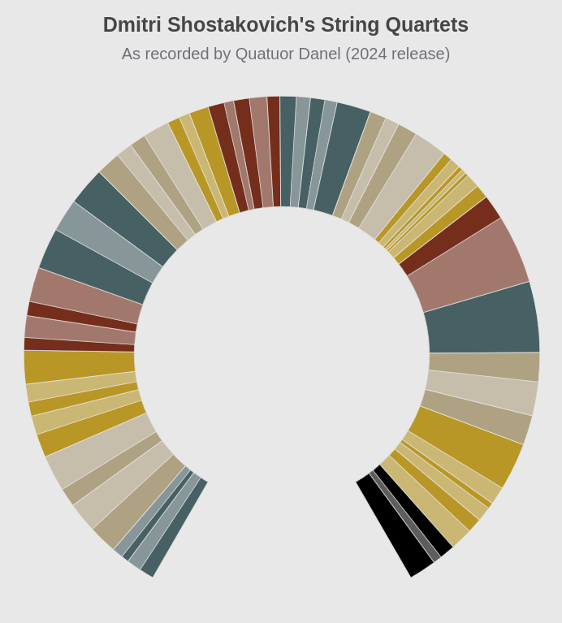

# Quatuor Danel - Dmitri Shostakovich Quartets
[Live Version](https://yclicc.github.io/DanelShostakovich/)

A data visualisation of the string quartets by Dmitri Shostakovich as recorded by Quatuor Danel. All timings (and movement divisions) are from their Accentus Music 2024 recording.

Data largely scraped from YouTube (are timings of CDs public domain?) whilst code is from ECharts generated with the help of Claude Opus.

